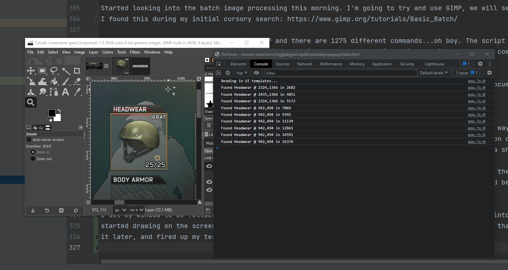
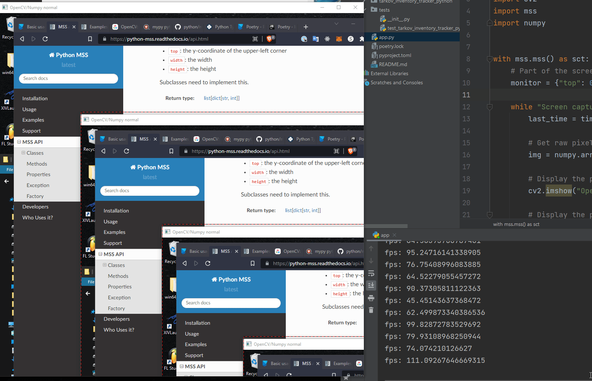
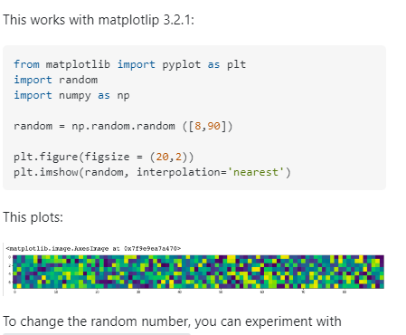
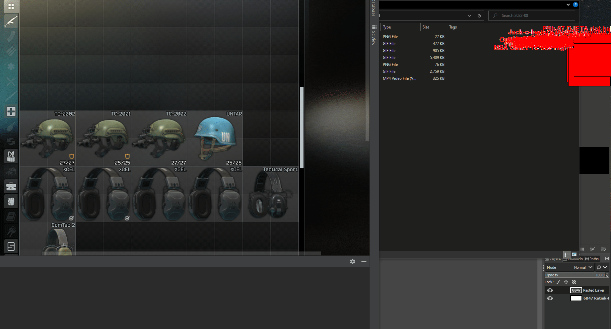
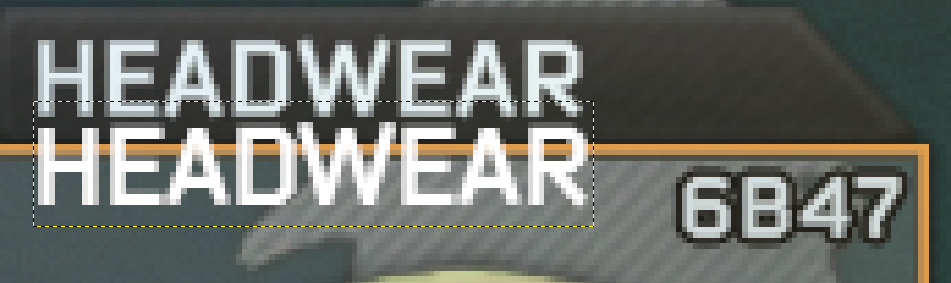
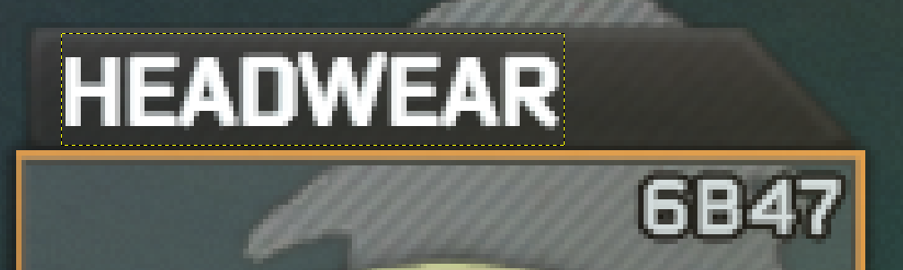
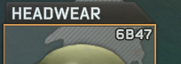

## Tarkov Image Processor

## Journal

Pretty awful name, nice. The general idea of this app is to use OpenCV's template matching to parse screenshots of 
Tarkov in order to keep track of player statistics. I'd like to be able to tell users things like:
 * Your favorite loadout is X
 * Your most common armor class is X, when you use X+1, you survive Y% more often
 * Survival rate for using weapon X is Y%

I don't even have a proof of concept yet, some concerns I have:

 * How fast is the evaluation? Does it negatively impact Tarkov?
 * How does different resolutions affect the image parsing?
 * How do I efficiently take screenshots of a running application? Is BattleEye or BSG going to hate that? Will I need
    to use native Windows modules?
 
I think the first order of business is going to be to take some screenshots in-game and get a PoC running. 

1. Set up a test of opencv that can find some random item in tarkov consistently from a screenshot.
2. Find a way to automatically grab screenshots from a running application
3. Implement an interface similar to getCurrentEquipment() -> json blob of items player is wearing
4. Find a way to track player "state", are they in raid, is the stash open, are we on the medical screen, etc
5. Write a crawler to download image files and metadata for every tarkov item. I wonder if this could be extracted from
   the game cache...
6. ???


## 07/29/2022

First issue! I'm trying to dev on WSL 2, but the app is going to run exclusively on Windows. I get a weird error when
trying to use the screenshot library I'm consuming:

```
 npm run start

> tarkov-image-processor@1.0.0 start
> tsc && node dist/app.js

node:internal/errors:841
  const err = new Error(message);
              ^

Error: Command failed: xrandr
/bin/sh: 1: xrandr: not found
```

I copied the code over to windows and it worked just fine, so I think for this app in particular I'm going to do the 
dev on Windows. The good news is that it did in fact work on Windows and grabbed a screenshot of the tarkov screen.
Windows defender did not like it though; I'm guessing there are going to be ways to digitally "sign" the released .exe
to hopefully get rid of any antivirus warnings in the future.

I'm excited to start writing some tests for these image comparisons. I'm going to start by just comparing the exact 
"inventory image" of the item. I'm hoping that goes well and is super fast and accurate, but if it is not, I think there
are a lot of things we will be able to try. It may end up being helpful to extract the "black and white" text from all images
and just use that.


## 07/29/2022 wow i was up late last night

I have tinkered around with the screenshot library a bit and it seems to be pretty dang quick, the retrieval of the 
screenshot on my 3440x1440 screen takes about 2-5 milliseconds which is wayyyy better than I was even hoping for.

My next problem is piping that data to opencv. First off, I'm using opencv-js which feels pretty second-class to the .net
community. I am getting this screenshot data as a `Buffer` and I need to get opencv to parse that somehow. I'm a little
nervous about getting errors that are hard to diagnose, especially considering I feel pretty weak in this area. I
could probably blow past this issue by writing the screenshot to disk and having opencv parse that, but I will lose my mind
because of how inefficient that is. 

Exciting news, found one of the tutorial pages on OpenCV that shows how to load in an image using `Jimp`, another image
library. Jimp seems to be able to import the buffer from the screenshot library just fine, so I think we are off to the 
races. An odd bit about Jimp is that their own documentation recommends you import it as a default type, and that type
is also the type that is returned from the 'static' methods used to ingest images:

```typescript
import Jimp from 'jimp'

screenshot()
  .then((buf: Buffer) => Promise.resolve(Jimp.read(buf)))
  .then((image: Jimp) => console.log(image.getMIME()))
  .catch((err) => { throw err })
```

Seems to work though, so it's all good with me! Unfortunately this step has raised the processing time by two orders of 
magnitude and we are now sitting at ~500ms just to execute the two lines above. That's already digging pretty deep into
my performance goal of being able to run this processor twice a second. 

I dug into the screenshot code a bit and I must have totally misread the timestamp before, I added some nicer formatting
and discovered that the screenshot itself takes about ~150 milliseconds on a monitor with my resolution. I looked at 
how the library itself was working and basically there is a .bat file embedded in the library that is responsible for 
actually retrieving the bitmap of the image. I'd like to be able to tinker with things like not converting the bitmap at
all, taking partial screenshots, using different win32 api calls, etc, so I am probably just going to rob the library of
this .bat file and consume it on my own. I'm a little nervous about how long OpenCV is going to take, I am worried about
anything longer than 1 second on my machine since it's fairly powerful and I doubt the average user is going to get faster
processing times than myself.

Okay I took a break, came back and reread this, and realized that I am being an insane person. Why am I caring about 500ms
vs 1 second vs 2 second when I don't even have the core of the app. 

## 07/30/2022

I got a test up and running, using a template image it is able to find the helmet successfully! I really should look up
a bit about how it actually works, the coordinates returned from the result are the exact same every time. I am not sure
why but I was expecting there to be a bit of variation between runs. Loading up the image in Jimp and having OpenCV ingest
the bitmap takes about 8 seconds, and the comparison takes about 800ms. 

Something is gonna have to be done about performance, I know I was saying it was premature yesterday but there is just no
way I'm gonna have something useful if each item takes 1 second. I need to be able to search 100s of items quickly. I'm
hoping that image size drastically impacts the timing, if it does then I am probably just going to move ahead with my 
idea of using just the black-and-white text to find images. Then I can modify the screenshot utility to only take a picture
of the left half of the screen, and hopefully we will have a usable processing time.

Uh oh, turns out I didn't have it working after all. Here is a snippet of the test:

```typescript
    const point = new cv.Point(maxPoint.x + templ.cols, maxPoint.y + templ.rows)

    dst.delete()
    mask.delete()
    templ.delete()

    expect([point.x, point.y]).toEqual([846, 127])
```

In this test case, turns out the `templ` image's size is 846x127. Upon inspecting the actual result of the template match
call, I discovered it's undefined. RIP. 

Okay that ended up being some async issues w/ Jest, I tried to load the image in a `beforeAll` but it caused the image
to not be there when the test was running. I plopped it all back in the test enclosure and now am starting to inspect 
my results. 

For the test where I SHOULD NOT find the template image, my result looks like this:

```
{
  "minVal": -50478908,
  "maxVal": 68386448,
  "minLoc": {
    "x": 2941,
    "y": 245
  },
  "maxLoc": {
    "x": 1991,
    "y": 65
  }
}
```

For the test where I SHOULD find the template image, my result looks like this:

```
{
  "minVal": -22742510,
  "maxVal": 37480360,
  "minLoc": {
    "x": 2671,
    "y": 402
  },
  "maxLoc": {
    "x": 719,
    "y": 0
  }
}
```


I popped open the stash image in GIMP and looked at some of the coordinates being output above. None of the coordinates
point where I would expect; the positive test case is sort of nearby the helmet but it is too
high. I'm wondering if there is some kind of offset in terms of me needing to account for image
size or something.  

While I was in Gimp I pulled out the text of the helmet and saved it. Using that instead of the full image nets me 
this result:

```
{
  "minVal": -2963167.5,
  "maxVal": 8348142,
  "minLoc": {
    "x": 880,
    "y": 733
  },
  "maxLoc": {
    "x": 922,
    "y": 189
  }
}
```

The maxLoc coordinates are right on the money! Cool stuff. I am wondering what the minVal and maxVal values 
are from; I saw a comment on a stackoverflow post that said they are measures of confidence, but the numbers
are very large and distance from one another. 

[The post in question](https://stackoverflow.com/questions/8520882/how-to-know-if-matchtemplate-found-an-object-or-not)

The answer:

    matchTemplate() returns a matrix whose values indicate the probability that your object is centered in that pixel.
    If you know the object (and only one object) is there, all you have to do is look for the location of the maximum value.
    
    If you don't know, you have to find the max value, and if it is above a certain threshold, your object should be there.
    
    Now, selection of that threshold is tricky - it's up to you to find the good threshold specifically for your app. 
    And of course you'll have some false positives (when there is no object, but the max is bigger than threshold), 
    and some false negatives (your object does not create a big enough peak)
    
    The way to choose the threshold is to collect a fairly large database of images with and without your object inside, 
    and make a statistic of how big is the peak when object is inside, and how big is when it isn't, and choose the
    threshold that best separates the two classes

I'm thinking of starting on the scraper that is going to pull down thumbnails for all these template images just to mix
up the work a bit. I remember having a teacher who was a fan of photoshop, and one day he showed us the "batch" processing
functionality that allowed him to modify different assets all at once. I'm wondering if I will be able to extract
the black-and-white item text in that fashion.

Before I forget, for completeness here is the result of the text for an item that is NOT on the screen:

```
{
  "minVal": -2654454.75,
  "maxVal": 3559548.5,
  "minLoc": {
    "x": 1353,
    "y": 605
  },
  "maxLoc": {
    "x": 1145,
    "y": 835
  }
}
```

The first thing I notice is that the relationship between the minVal and maxVal numbers aren't what I was expecting. If a 
larger maxVal indicates higher confidence, I would expect the negative test case with the full template image earlier to
have a lower value than it's opposite, positive test case. The test results before were not very good, although I am still a 
little weirded out.

Okay made some progress on the web crawler / scraper front, revel in it's glory:

```typescript
function rowToHelmet(rowElement: Element): Helmet & { iconUrl: string } | undefined {
  const $ = cheerio.load(rowElement)
  try {
    return {
      name: $('a').attr('title'),
      material: $('td:nth-child(3)').text().replace('\n', '') as ArmorMaterial,
      class: parseInt($('td:nth-child(4)').text().replace('\n', '')) as ArmorClass,
      areas: $('td:nth-child(5)').text().replace('\n', '').replace(' ', '').split(',') as HelmetArea[],
      durability: parseInt($('td:nth-child(6)').text().replace('\n', '')),
      effectiveDurability: parseInt($('td:nth-child(7)').text().replace('\n', '')),
      ricochetChance: $('td:nth-child(8)').text().replace('\n', '') as RicochetChance,
      movementSpeedPenalty: parseInt($('td:nth-child(9)').text().replace('\n', '').replace('%', '')),
      turningSpeedPenalty: parseInt($('td:nth-child(10)').text().replace('\n', '').replace('%', '')),
      ergonomicsPenalty: parseInt($('td:nth-child(11)').text().replace('\n', '').replace('%', '')),
      soundReductionPenalty: $('td:nth-child(12)').text().replace('\n', '') as SoundReduction,
      blocksHeadset: $('td:nth-child(13)').text().replace('\n', '') === 'Yes',
      weight: parseFloat($('td:nth-child(14)').attr('data-sort-value')),
      iconUrl: $('img').attr('src'),
    }
  } catch (err) {
    console.error(`Error while parsing helmet row: ${err}`)
    return undefined
  }
}
```

Cheerio worked perfectly, very neat. Now to test the crawler aspect, I'm curious to see how it works in terms of concurrent
image downloads. Things I need to think about moving forward:

1. Check out SQLite, if we are going to be keeping track of user data over a long period of time, that might be a nice
   way to go about it
2. Investigate how image size affects the ability to template-match. I'm wondering if my bad results from the first 
   matching tests had anything to do with the actual sizes of the images not matching up. I'm not even sure if that would matter,
   I may have to do some resizing w/ Jimp or figure out a standard ratio going forward.
3. Bulk processing of these images in order to extract the black and white text. It would be neat if I could commit 
   whatever that solution ends up being...

## 07/31/2022

Interesting, I am seeing different results using the crawler than I am with my browser. Part of my code selects the nearest
image inside of a table row, finds its source, and assumes that is the icon image for the given piece of gear. In my browser
most of these URLs are pretty normal: [Altyn Image](https://static.wikia.nocookie.net/escapefromtarkov_gamepedia/images/2/2d/AltynHelmetIcon.png/revision/latest?cb=20180517203714)

I took the response of the crawler and replaced my test file's contents with the response's body and noticed the URLs are 
different: `data:image/gif;base64,R0lGODlhAQABAIABAAAAAP///yH5BAEAAAEALAAAAAABAAEAQAICTAEAOw%3D%3D`

I wonder what is up with that? What is also weird is that the very first entry in the table has an image, but none of the
others do. My first thought is that this is actually anti-crawler behavior to help protect their bandwidth, which would
maybe be a little annoying but not that bad. I can just use a headless browser to gather the image URLs and then still
just pass them to Crawler if I wish. 


Okay turns out it was nothing, seemingly randomly the web page uses `data-src` to hold the real URL. The scraper works!
I think all helmets have been downloaded. Next up I'm going to write some helmet-scanning code to see if I can detect
equipment changes. I'm guessing this will be pretty chunky and lead in to pulling out the `screenshot-desktop` code. 


Started looking into the batch image processing this morning. I'm going to try and use GIMP, we will see how that goes.
I found this during my initial cursory search: https://www.gimp.org/tutorials/Basic_Batch/

I popped open the procedure browser in GIMP and there are 1275 different commands...oh boy. The script structure looks
very Lisp-y to me as well, kind of interesting. Luckily, once I have this script, I will be able to commit it to the repo
which I am oddly hung up about.

More good news! Turns out you can just write in python and GIMP knows how to interpret that. More documentation [here](https://www.gimp.org/tutorials/Automate_Editing_in_GIMP/)

## 08/01/2022

Tons of progress, but I have a true proof of concept now. I decided that I wanted some kind of nice way to visually debug
what was going on. I also knew that I was going to need a UI of some kind for options and information display. I had read
a little bit about [nwjs](https://nwjs.io/) but hadn't played with it yet, so I decided to give it a shot.

All in all, it's worked pretty flawlessly out of the box. Basically you download their sdk, and run the included binary
while passing the path to this repository as an argument. It does some spooky interpretive magic and behold, you have a 
native app.

I set my window to be fullscreen, transparent and frameless. Then I added a canvas element, hooked into the context and
started drawing on the screen. I extracted some text for the "HEADWEAR" slot since I am pretty sure that I am going to need
it later, and fired up my test...

***



***

Future note to self: example gifs with text as the background are a little confusing to look at. But it works! We can 
see that the evaluation takes ~2 seconds on the right, and that is with a single image. I think next steps for me are to
start actually applying some organization to the code while coming up with an interface I can test using some static images.

A friend of mine drew my attention to `worker_threads` in node which provide true parallelism. I'll have to start running 
some tests with that and see if we can squish this template matching code's execution time down a bit.  

## 08/01/2022

Oof rough day, exciting stuff on the horizon though. I found a theoretically much faster screenshot library that advertises ~50ms 
in-memory screenshots, and I also started on using worker_threads to parallelize the template matching. Lots of bugs to
sort out, and unfortunately the worker_threads seem to only accept .js files, so I don't have any type assistance for 
this work. 

## 08/02/2022

I've been getting into the problem of "okay, we have a screenshot, now how to check 100s of items on it at once?" and am
starting to run into problems that I think may be alleviated by using a different platform. I started out using Node and 
TypeScript because I know it and I wanted to try out nwjs; staring down the barrel of performance limitations for this problem
space, setting up more front end tooling to reduce binary size and also getting it all working with opencv.js is reducing
my appetite for grinding away at this problem.

I'm going to try and set up some of this in python, which is something I'd classically advise against, but here we gooooo


Dang lots to learn here with the python ecosystem, a friend suggested I start with [Poetry](https://python-poetry.org/)
and that has been a major help. I am not 100% sure about the way virtualenv works or how the dependencies are actually 
managed, but [the IntelliJ Poetry Plugin](https://plugins.jetbrains.com/plugin/14307-poetry) seems to work perfectly.
[Python MSS](https://python-mss.readthedocs.io/api.html) seems pretty promising, their opencv example was literally
drag-and-drop to run. Very excitingly it gets ~30fps grabbing my entire screen and easily 60fps grabbing a 1000px square
section. 




***

Wow, the ecosystem for this kind of work in python is amazing. Just look at the kinds of stack overflow answers there 
are:

[](https://stackoverflow.com/questions/10540929/figure-of-imshow-is-too-small)

I feel like I am just where I was with the Node setup but that I have far less code and "stuff" in my repository to get 
an even better result. Better tool for the job I suppose. Running this:

```python
img = cv2.imread('../tests/res/stash-screenshot-gear.png', 0)
img2 = img.copy()
template = cv2.imread('../data/template/ui/headwear.png', 0)
w, h = template.shape[::-1]

methods = ['cv2.TM_CCOEFF', 'cv2.TM_CCOEFF_NORMED', 'cv2.TM_CCORR',
           'cv2.TM_CCORR_NORMED', 'cv2.TM_SQDIFF', 'cv2.TM_SQDIFF_NORMED']

for meth in methods:
    img = img2.copy()
    method = eval(meth)
    # Apply template Matching
    res = cv2.matchTemplate(img, template, method)
    min_val, max_val, min_loc, max_loc = cv2.minMaxLoc(res)
    # If the method is TM_SQDIFF or TM_SQDIFF_NORMED, take minimum
    if method in [cv2.TM_SQDIFF, cv2.TM_SQDIFF_NORMED]:
        top_left = min_loc
    else:
        top_left = max_loc
    bottom_right = (top_left[0] + w, top_left[1] + h)
    cv2.rectangle(img, top_left, bottom_right, (255, 255, 255), 4)
    plt.figure(figsize=(20, 10), dpi=100)
    plt.imshow(img)
    plt.title('Detected Point'), plt.xticks([]), plt.yticks([])
    plt.suptitle(meth)
    plt.show()
```

nets me a picture like this:


I think my next step is to recreate the fullscreen transparent window canvas, then on to actual equipment parsing! Python
conversion day ends on a high note.

## 08/07/2022

It has been quite the trial getting my environment all sorted out, particularly with things pertaining to `opencv-python`. 
I had no autocomplete or module inspection of any kind, and absolutely could not sort it out. I thought, "Well, okay fine
this is how the pioneers did it, reading literal books for reference". Unfortunately the opencv-python documentation is
truly not great, especially for someone like myself who is desperate for type hints since I am so weak at python. 

In the end I needed to disable the IntelliJ Poetry plugin downgrade my opencv-python version from 4.6.0 to 4.5.5. I am 
still tinkering with all the tooling choices. I have `mypy`, `poetry` and `pylint`, I'd like clearer type hints but I
am hoping idioms / common patterns start to expose themselves. 

The lack of static typing is giving me the feeling of wandering in the dark a little bit; I have had an error opencv + mss
that I've been slowing poking at while I get up to speed on syntax / tools. 

`OpenCV: Error (-215) depth == CV_8U || depth == CV_16U|| depth == CV_32F in function cv:::cvtColor`

The resultant fix for the code is contained in the following:

```python
template = cv2.imread('./data/template/ui/headwear.png', flags=cv2.IMREAD_GRAYSCALE)
w, h = template.shape[::-1]

with mss.mss() as sct:
    # Part of the screen to capture
    monitor = {"top": 0, "left": 0, "width": 3440, "height": 1440}
    while "Screen capturing":
        last_time = time.time()
        capture = numpy.array(sct.grab(monitor), dtype="uint8")
```

I needed to provide the `flags` argument to `imread` and the `dtype` argument to `numpy.array`. My understanding is that 
the colors ("depth", in the error) didn't match somehow for opencv. It's cool that the two libraries work together in this
way, I just wish I had a better grasp on how to figure this out besides blindly guessing and piecing together stackoverflow 
answers from long ago.

I'm going to check out `tkinter` and figure out the fullscreen transparent window next.

## 08/08/2022

Tkinter is delightfully easy to use as well! I got a tracking rectangle drawing on my single template while I moved 
the testing screenshot around. I'm running into an odd problem now though, perhaps one I am too fried to see the root cause 
of. Here is my code:

```python
 while "Capturing Screen":
     print('tick')
     screen = screen_capture()
     canvas.delete('all')
     detected_objects = []
     
     for name, template in headwear_templates:
         w, h = template.shape[::-1]
         res = cv2.matchTemplate(screen, template, eval('cv2.TM_CCOEFF'))
         min_val, max_val, min_loc, max_loc = cv2.minMaxLoc(res)
         top_left = max_loc
         bottom_right = (top_left[0] + w, top_left[1] + h)
         print(max_val)
         if max_val > 6_000_000:
             print('Adding {name}'.format(name=name))
             detected_objects.append((name, top_left, bottom_right))
             
     for o in detected_objects:
         print('Found {name}'.format(name=o[0]))
         top_left = o[1]
         bottom_right = o[2]
         canvas.create_text(top_left[0], top_left[1] - 16, text=o[0], fill="red", font='Helvetica 15 bold')
         canvas.create_rectangle(top_left[0], top_left[1], bottom_right[0], bottom_right[1], fill='red')

     canvas.pack(fill=tk.BOTH)
     window.update()
```

The problem I am seeing is that I get "tick" to output several times a second, while the `print(max_val)` statement
only executes once. I would expect to be iterating through the entirety of headwear_templates each time I loop through.
I think this rubber duck just succeeded after writing that last sentence; perhaps `headwear_templates` is a kind of iterator
and is "spent" after looping through it. Let's see...

Ha! Yep, this fixed it: `headwear_templates = list(map(lambda f: (f.name, cv2.imread(f.as_posix(), flags=cv2.IMREAD_GRAYSCALE)), headwear_files))`

Alright, seems like my template images are not very good. That's not surprising honestly, the quality of images pulled from the site 
were very low quality. Tomorrow I am going to revist my scraper, and perhaps think about getting the images from a better
location.



I found where Tarkov stores the cached icons: `{USER}\AppData\Local\Temp\Battlestate Games\EscapeFromTarkov\Icon Cache\live`
They are numbered; I wonder if each item gets the same # each time the cache is rebuilt? If not, that would be a little unfortunate
regarding any plans to not ship the app with these image files.

RIP, they do not have a deterministic order. Not surprising though. Interestingly, I found that the font that they use 
is called "Bender". It's completely free to use; I wonder how possible it would be to generate the template image by 
rendering text? That is the only part of the image I want to try and matching on anyway, for now. If that doesn't work 
then we can try matching on just the full image itself but I am worried about how long that might take; I still haven't
had enough time with this new version to see if it is mostly the size of the source image or the collective size of 
everything that matters more.

Rendering the Bender font at size 20 and bold yields the following result on a screenshot of my 3440x1480 screen



Overlap:




-----

Wooooo the text rendering is working very well for the "slot" text:


Unfortunately less so for the item text, I am guessing I will just have to generate them differently. Here is the code
for the slot text generation:

```python
 script_path = Path(__file__).parent
 font_path = (script_path / '../data/Jovanny Lemonad - Bender-Bold.otf').resolve()
 font = ImageFont.truetype(font_path.as_posix(), 20)

 templates_to_generate = {
     "HEADWEAR": "HEADWEAR",
     "EARPIECE": "EARPIECE",
     "EYEWEAR": "EYEWEAR",
     "ON SLING": "ON SLING",
     "ARMBAND": "ARMBAND",
     "SHEATH": "SHEATH",
     "HOLSTER": "HOLSTER",
     "FACE COVER": "FACE COVER",
 }

 for n in templates_to_generate:
     text = templates_to_generate[n]
     font_img = Image.new('RGBA', (75, 22), (0, 0, 0, 0))
     drawer = ImageDraw.Draw(font_img)
     drawer.text((1, 1), text, fill=(210, 210, 210, 255), font=font, stroke_width=1, stroke_fill=(40, 40, 40, 255))
     font_img.save((script_path / '../data/template/headwear/processed' / n).resolve().as_posix() + '.png')
```

Since the slot detection seems pretty accurate, perhaps the move now is going to be trying to parse equipment only inside
some kind of "bounding box" defined by the slot positions, so basically only things inside a square whose top left corner 
would be "EARPIECE" and whose bottom right corner would be "BACKPACK"

I'm running into another issue, 'alpha' values on an image seem to muck the whole thing up a bit. I think since the equipment slot handling 
is working so well I am just going to move forward with slicing up the main screenshot image and parsing only the area
"around" the slot. Perhaps alpha can be made to work as I'd like, there is a 'mask' parameter to matchTemplate that
seems to be [related](https://github.com/opencv/opencv/pull/3554)


I'm getting a ways into scanning each of the UI slots separately and am wanting to write down my strategy:

   * Scan left half of the user's screen to detect UI elements on the equipment screen
   * Slice up smaller sections of the screen to scan for relevant pieces of equipment 
     * ex. Create a box near the "HELMET" ui template location, and only scan that box for each helmet item
   * To smooth out 'jitteryness' maybe we store our results in a sliding window that we query instead, ie. only show
     helmet information if we have seen the same helmet in 90% of our last X screenshots

Sectioned scanning done; Idea to improve slot-based scanning is to take a picture of the background for each slot and write
the actual text on top of that so that we cover weird little things like this:



Just ran a live test and the results are mixed. Some helmets work perfectly, others get confused. The "Bomber" and the "TK FAST MT"
are popular false-positives. How to improve results? 
